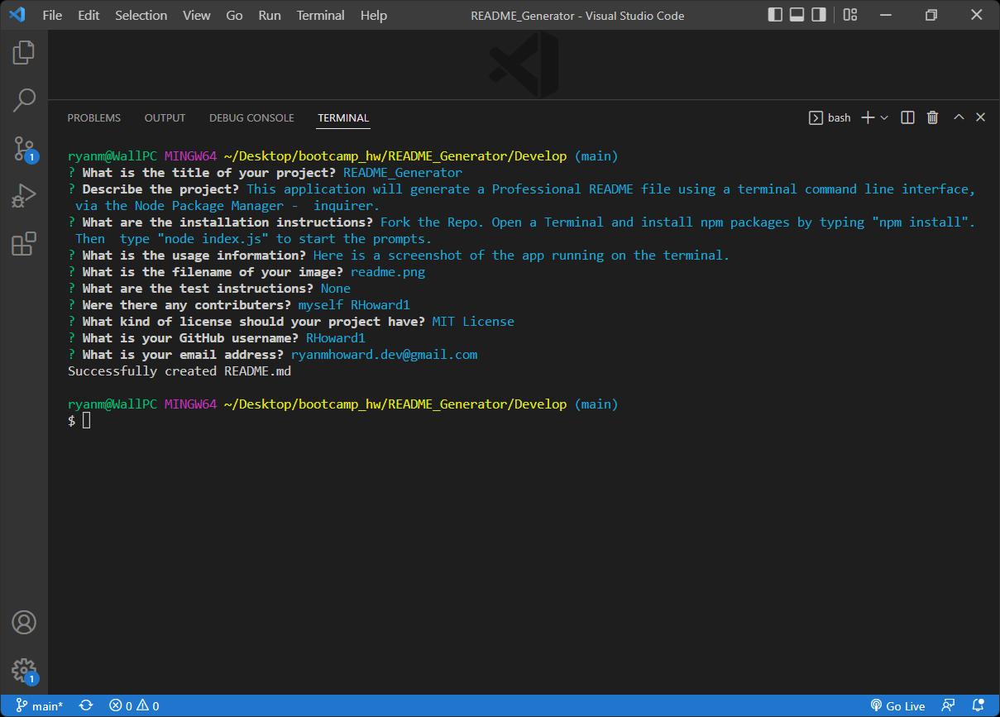

# README_Generator

## License

## Table of Contents
- [Project Description](#project-description)  
- [Installation Information](#installation-information)  
- [Usage Information](#usage-information)  
- [Test Instructions](#test-instructions)  
- [Contributors on this Project](#contributors-on-this-project)  
- [Contact Information](#contact-information)  
  
## Project Description
- This application will generate a Professional README file using a terminal command line interface, via the Node Package Manager -  inquirer.
  
## Installation Information
- Fork the Repo. Open a Terminal and install npm packages by typing "npm install". Then  type "node index.js" to start the prompts.
  
## Usage Information
- Here is a screenshot of the app running on the terminal.
- 

## Contributors on this Project
- none other than myself RHoward1
- *[Contribution Guidlines](https://github.com/github/docs/blob/main/CONTRIBUTING.md)*
  
## Test Instructions
- none at this time.

## Questions

- If you have any questions about the repo, open an issue or contact me on Github or by Email.
### Contact Information
- Github [RHoward1](https://github.com/RHoward1)
  - Email at ryanmhoward.dev@gmail.com

## License Statement
- This application is covered by the  license.
- Visit [MIT](https://opensource.org/licenses/MIT) for more information.
